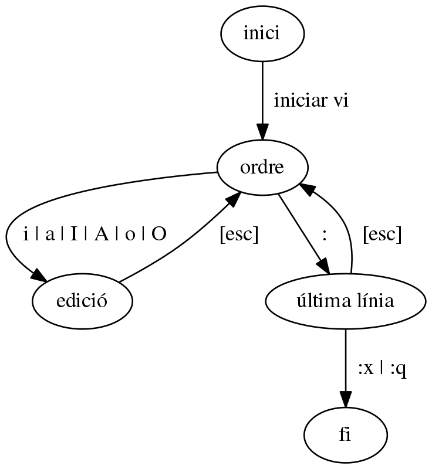

# Editor VI

---

---

# 3 estats o modes

## mode ordre 
## mode edició 
## mode última fila 

---

# mode ordre 
## se realitzen accions: 
- avançar
- esborrar
- copiar

---

# mode edició 
## el que tecleges apareix

---

# mode última fila 
## instruccions
- conservar els canvis
- cancel·lar els canvis
- buscar cadenes de caracters

---

# transició entre estats
## al mode ordre vaig amb [esc]
## al mode edició amb [a],[i],[o]
## al mode ultima línia [des del mode ordre] amb [:]

